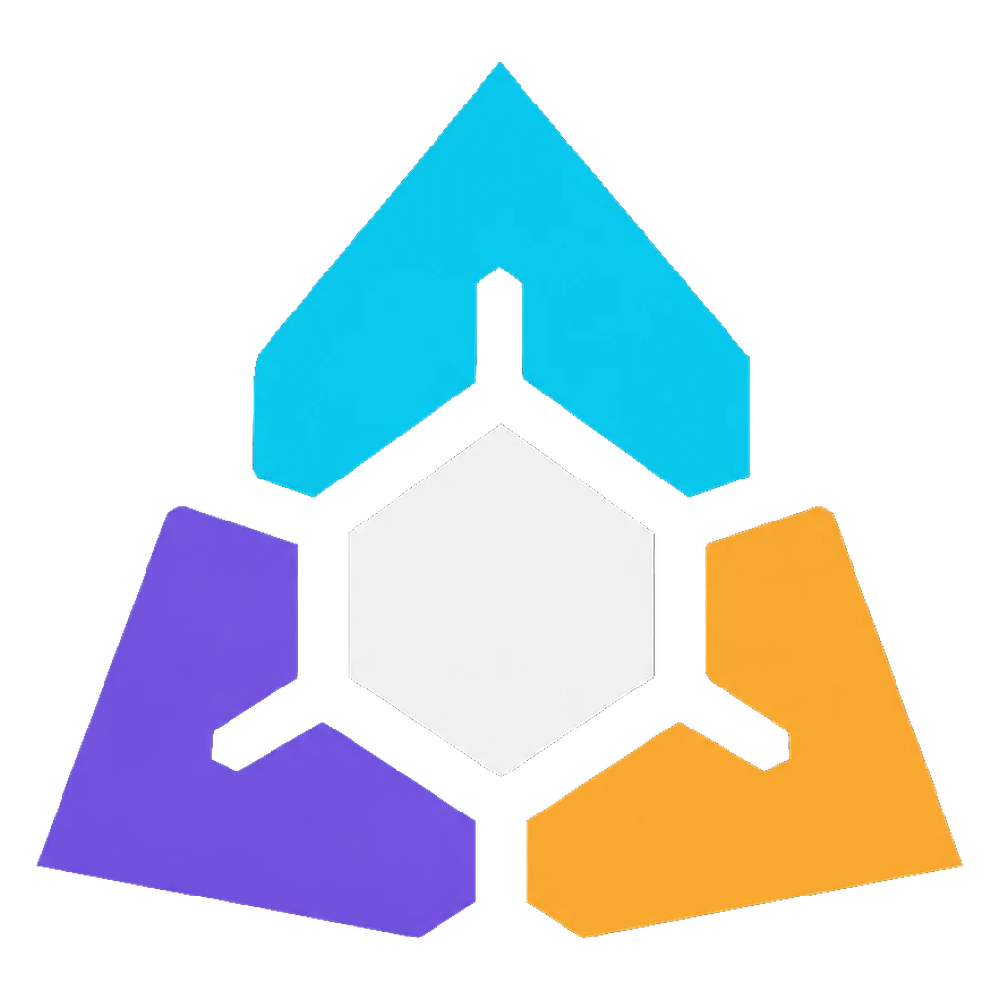
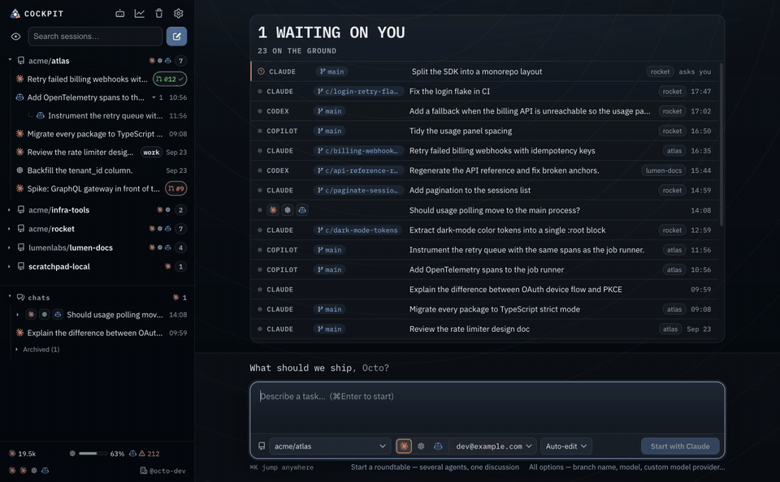
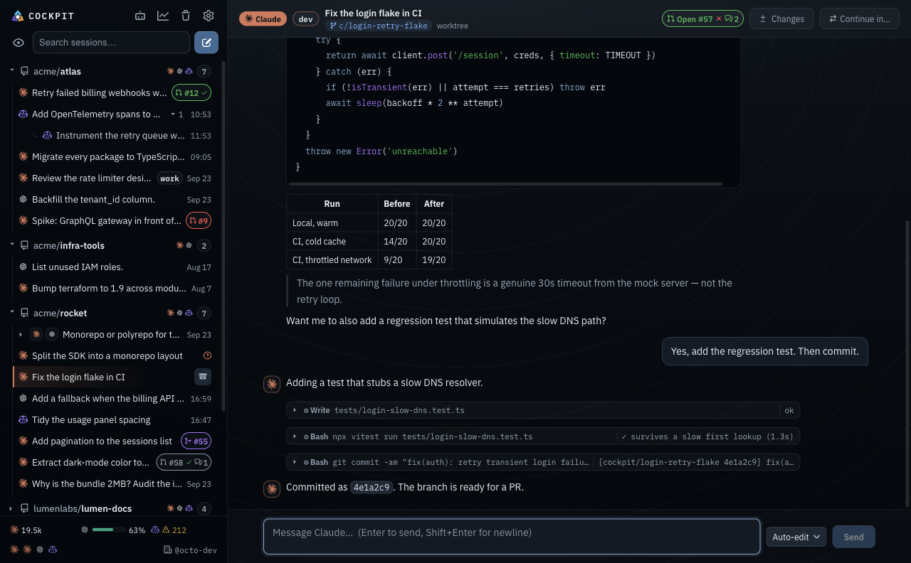
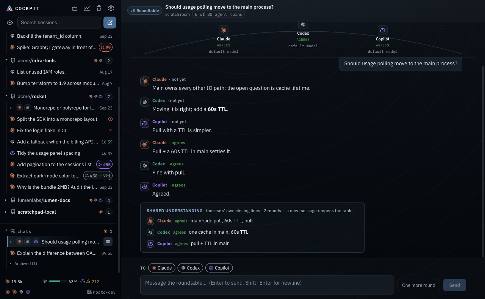
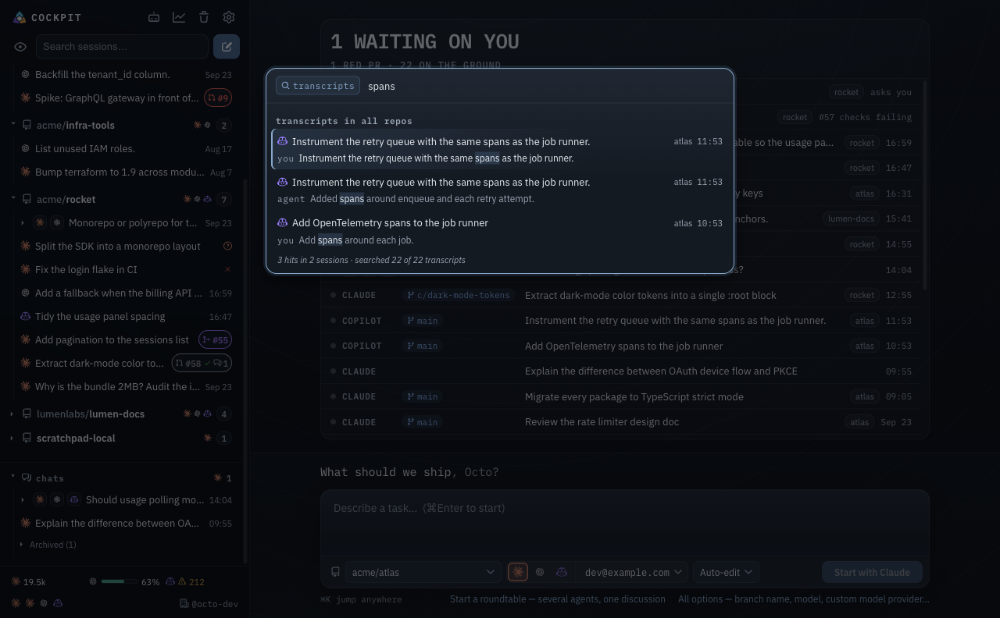

<p align="center">
  
</p>

<h1 align="center">Cockpit</h1>

<p align="center">
  Every Claude Code, Codex and GitHub Copilot CLI session, across every repo, in one window.<br>
  See what your agents are doing, answer the one that's waiting on you, and ship each task as a pull request.
</p>

<p align="center">
  <a href="#install">Install</a> ·
  <a href="https://tashtit.github.io/cockpit/">User guide</a> ·
  <a href="https://github.com/tashtit/cockpit/issues/new?template=bug.yml">Report a problem</a> ·
  <a href="https://github.com/tashtit/cockpit/discussions">Discussions</a>
</p>

<p align="center">
  
</p>

## Why Cockpit

- **Your history is already there.** Cockpit reads the session logs Claude Code, Codex and Copilot CLI already write, so the first launch lists every session you have run — in a terminal, an editor or the agents' own apps — grouped by repository and branch, and it stays live as you work.
- **It tells you when an agent needs you.** The board shows what is flying, what has landed and what is waiting on your answer. A notification and a Dock badge arrive when a turn ends, fails or asks you a question, and when a pull request on your branch goes red.
- **Work lands as a pull request.** A new task runs on its own branch in its own git worktree, never in your checkout. Review the diff, open the PR, and when checks fail or a reviewer asks for changes, **Fix with Claude** turns all of it into one prompt.

Also in the box:

- **⌘K search** across every agent's transcripts — "where did I discuss that?"
- **Roundtables** — several agents on one question, discussing until they agree.
- **One AI setup** — shared instructions, MCP servers and skills across all three agents, with drift detection.
- **Accounts and usage** — who each CLI is signed in as, and how much of your subscription is left.
- **Your own models** — custom providers (Ollama, LiteLLM, gateways) for Claude Code and Copilot, and any agent that speaks ACP.
- **Cleanup** — stale sessions, worktrees, and the dev servers still running inside them.

<table>
  <tr>
    <td width="33%"></td>
    <td width="33%"></td>
    <td width="33%"></td>
  </tr>
  <tr>
    <td align="center">Continue any session</td>
    <td align="center">Roundtables</td>
    <td align="center">Search every transcript</td>
  </tr>
</table>

## Install

```bash
curl -fsSL https://raw.githubusercontent.com/tashtit/cockpit/main/scripts/install.sh | sh
```

or with Homebrew (add `--adopt` if Cockpit is already installed):

```bash
brew install --cask tashtit/tap/cockpit
```

Either one installs the latest release for your Mac, checked against the SHA-256 digest GitHub recorded for it, and it opens straight away. Cockpit then keeps itself up to date. The [installer](scripts/install.sh) is plain `sh`; add `sh -s -- --dry-run` to see what it would do first.

Prefer the disk image? It is on the [latest release](https://github.com/tashtit/cockpit/releases/latest). Releases are not signed with an Apple Developer ID yet, so macOS blocks a browser download's first launch once — [Getting started](https://tashtit.github.io/cockpit/guide/getting-started) walks through it.

**Needs** macOS 13 or later (Apple silicon or Intel) and at least one of Claude Code, Codex or Copilot CLI. The pull request features use the GitHub CLI (`gh`).

**Privacy.** No account and no telemetry. Everything Cockpit shows comes from files on your Mac and stays there. It goes online only for update checks and your pull requests (GitHub), to see whether your agent CLIs are current (the npm registry), and to reach any model provider you add yourself.

## Feedback

Cockpit is early, and what you tell us decides what comes next.

- Something broke → [Report a problem](https://github.com/tashtit/cockpit/issues/new?template=bug.yml)
- A session is missing or shows the wrong thing → [Sessions missing or wrong](https://github.com/tashtit/cockpit/issues/new?template=sessions.yml)
- Something it should do → [Suggest an idea](https://github.com/tashtit/cockpit/issues/new?template=idea.yml)
- Anything else, or to show how you use it → [Discussions](https://github.com/tashtit/cockpit/discussions)

Inside the app, **Settings › About › Feedback** opens the same forms with your Cockpit, macOS and agent CLI versions already filled in.

## Build from source

Node 24 (`.nvmrc`), then:

```bash
npm ci
npm run dev
```

[CONTRIBUTING.md](CONTRIBUTING.md) covers the test tiers, packaging, releases and how the code is laid out; [AGENTS.md](AGENTS.md) is the architecture in depth.

## License

[Apache-2.0](LICENSE)
